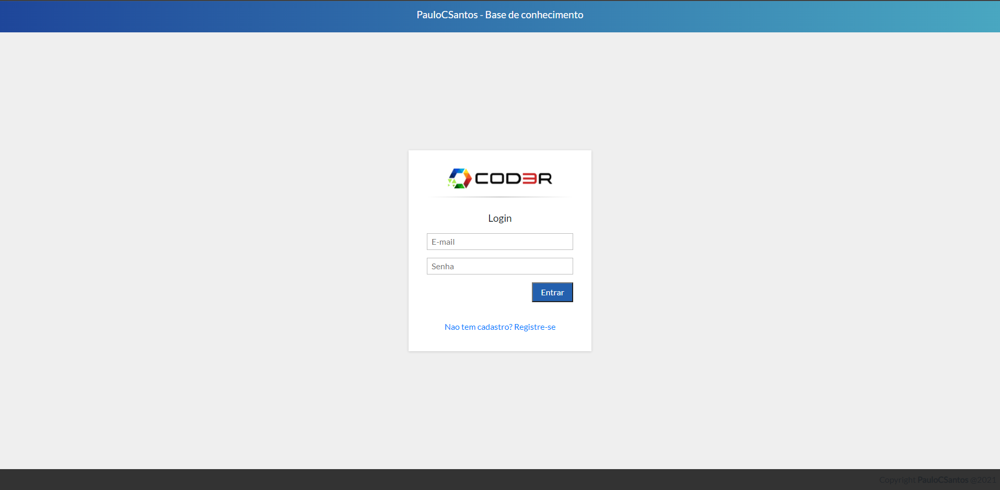
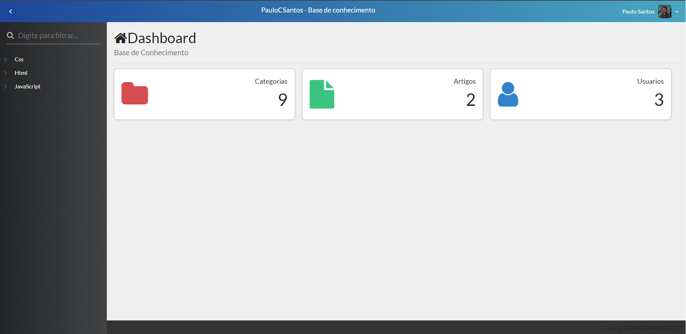
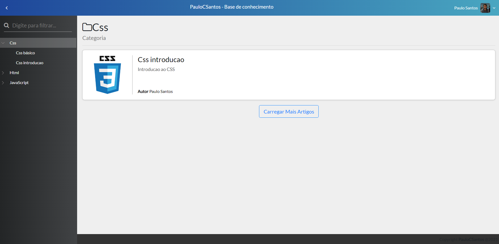
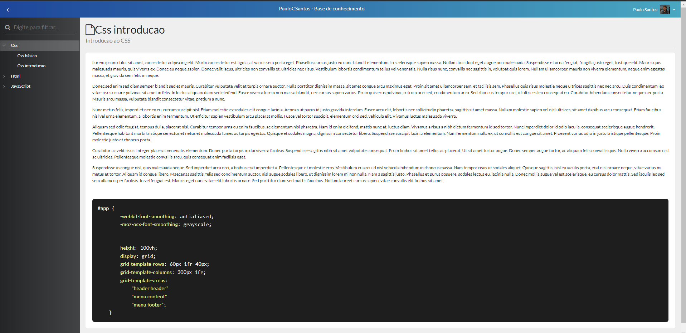
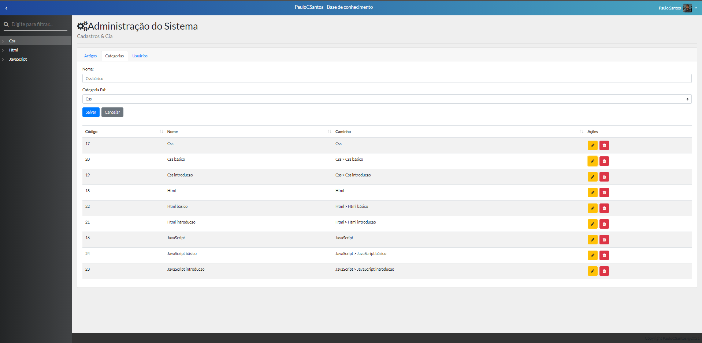
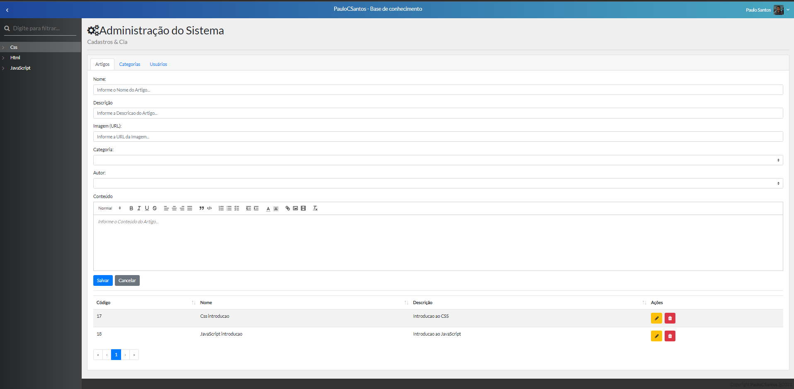

# CRUD COD3R 

# Sobre o projeto

Aplicação crud(create-read-update-delete) desenvolvida durante o curso Web-Moderno da Cod3r. Foi criado um repositório para armazenar artigos criados por usuários administradores que podem ser acessados por usuários comuns.

### Explicação

- Exemplo do funcionamento do sistema

#### Usuário administrador

- Pode criar/alterar/remover uma categoria de artigos
- Pode criar/alterar/remover um artigo
- Pode criar/alterar/remover um usuário cadastrado

#### Usuário comum

- Pode acessar uma categoria de artigos
- Pode acessar um artigo

## Imagens da aplicação

### login-cadastro



### pagina inicial



### pagina de categorias



### pagina de artigo



### pagina administrador criar/editar/remover categorias



### pagina administrador criar/editar/remover artigos



# 🚀 Começando

Essas instruções permitirão que você obtenha uma cópia do projeto em operação na sua máquina local para fins de desenvolvimento e teste.

## 📋 Pré-requisitos

- npm / yarn
- PostgreSQL
- MongoDB
- knex

## 🔧 Instalação
### :warning::warning: **A pasta img-crud**: é para guardar as imagens usadas no readme.md! Apagar ela depois do clone :warning::warning:
``` bash

##  são utilizados quatro terminais:
- MongoDB
- Postgres
- Frontend
- Backend

## iniciar o terminal para uso do mongodb
digite mongod
colocar a senha criada na instalação do mongodb
obs: depois de carregado a mensagem final que aparece é "waiting for connections on port 27017"

## em outro terminal

## iniciar o terminal do postgres
psql -U postgres
colocar a senha criada na instalação do postgres

## criar o banco de dados
CREATE DATABASE knowledge

## em outro terminal

## clonar repositório
git clone https://github.com/PauloCSantos/crud-curso-cod3r.git

## entrar na pasta do projeto
cd versao-inicial

## entrar na pasta do frontend
cd frontend

## instalar as dependencias
npm install

## executar o projeto
npm run serve

## em outro terminal

## entrar na pasta do backend
cd backend

## instalar as dependencias
npm install

## instalar o knex globalmente
npm i -g knex

## preparar o .env
na pasta backend encontrar o arquivo env_file
copiar seu conteúdo
criar um arquivo com o nome .env
colar o conteúdo e preencher corretamente como escrito
salvar

## executar o projeto
npm start

## acessar o frontend na porta 8080
cadastrar um usuario na tela inicial

## no terminal do postgres habilidar o usuario administrador
update users set admin = true where id = 1;

# Agora com seu usuário administrador você pode testar o sistema
```

## 🛠️ Construído com

- HTML / CSS / JS  
- VueJS
- JWT 
- Bootstrap-vue
- font-awesome
- knex
- mongoose
- express

## ✒️ Autor

* **Paulo C Santos** - [Linkedin](https://www.linkedin.com/in/paulocsantos1995/)

## 🖐️ Agradecimento

Agradeço a equipe Cod3r e ao professor Leonardo pelo maravilhoso curso de Web-Moderno 

-Link do curso: https://www.udemy.com/course/curso-web/
